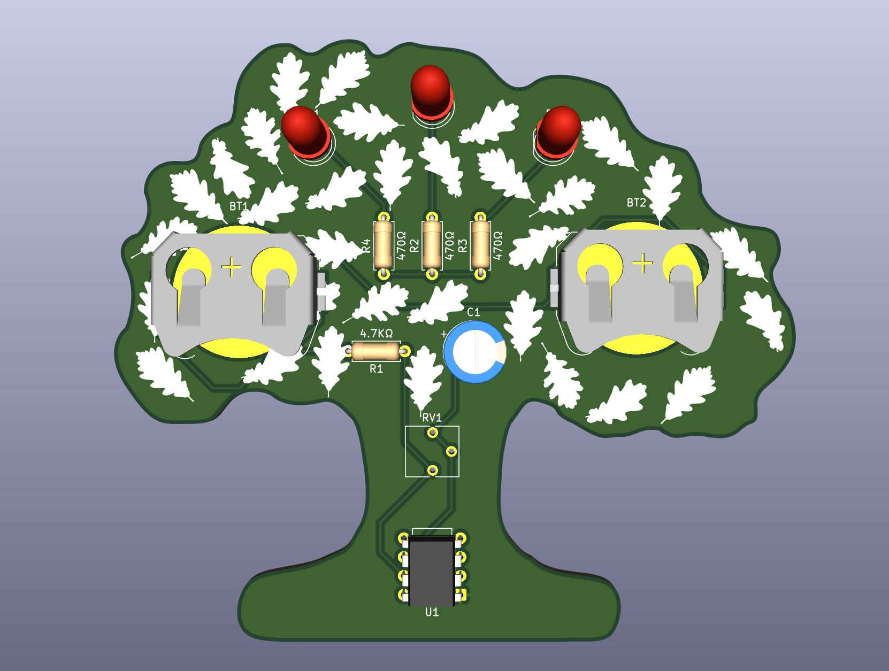
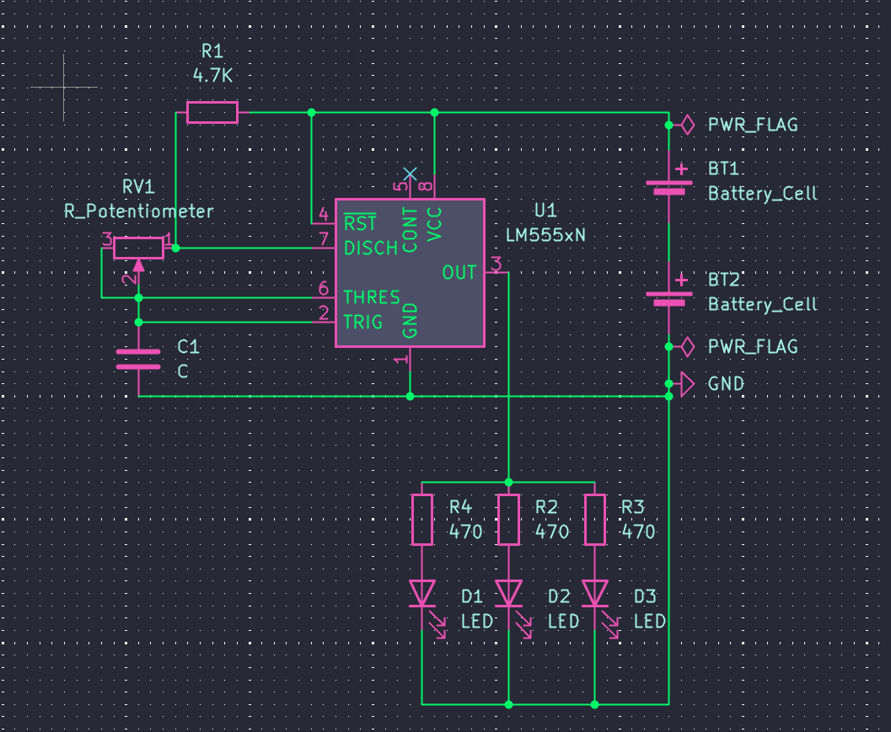
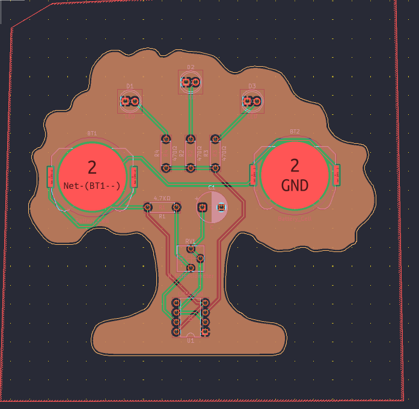
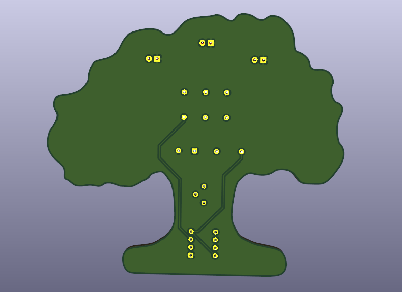

# SolderTreePCB

This is a PCB that looks like a tree (very cool, i know), and by changing the value of the potentiometer, the LEDs will blink faster or slower! This is possible by using a 555 timer, a potentiometer, resistors, some leds, 2 battery cells and a capacitor.
[Falstad circuit test link](https://www.falstad.com/s.php?s=4itItj)

Slack username: rasmus.stenlund
## BOM
- 2x CR2032 battery cell holders
- 3x resistors 470Ω
- 1x resistor 4.7KΩ
- 1x 10uF capacitor
- 1x potentiometer
- 1x 555 Timer
- 3x LEDs

## Screenshots

